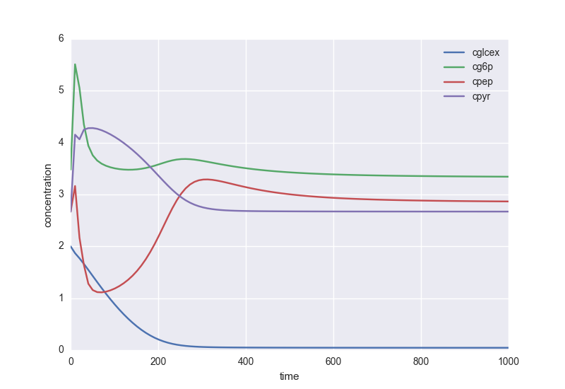

================
Kinetic modeling
================

*framed* implements some basic (and experimental) support for working with kinetic models.

It now also supports models that contain assignment rules (see for example the
`Chassagnole 2002 <https://www.ebi.ac.uk/biomodels-main/BIOMD0000000051>`_ *E. coli* model).

Simulation
----------

Time-course
~~~~~~~~~~~

Running a simple time-course simulation (uses scipy
`odeint <https://docs.scipy.org/doc/scipy/reference/generated/scipy.integrate.odeint.html>`_):

::

    from framed import time_course
    T, X = time_course(model, time=100)

You can change the number of integration steps:

::

    time_course(model, time=100, steps=1000)

You can override model parameters without changing the model:

::

    time_course(model, time=100, parameters={'Vmax1': 10.0, 'Vmax2': 20.0})

Steady-state
~~~~~~~~~~~~

Find the steady-state metabolite concentrations and reaction rates:

::

    from framed import find_steady_state
    x_ss, v_ss = find_steady_state(model)

Again, you can easily override model parameters for simulation purposes:

::

    find_steady_state(model, parameters={'Vmax1': 10.0})

Sampling
--------

You can sample the steady-state solution space by manipulating the model parameters:

::

    from framed import sample_kinetic_model
    sample_kinetic_model(model, size=100)

You can define which parameters to sample:

::

    sample_kinetic_model(model, size=100, parameters=['Vmax1', 'Vmax2'])

And you can define properties of the sampling distribution:

::

    sample_kinetic_model(model, 100, distribution='normal', dist_args=(0, 1), log_scale=True)

Calibration
-----------

*framed* has basic support for calibrating kinetic models using time-course metabolomics data:

::

    from framed import fit_from_metabolomics
    fit_from_metabolomics(model, t_steps, data)

where **data** is a dictionary with time-course values for every measured metabolite.

You can specify which parameters you want to calibrate (by default it attempts to fit all parameters):

::

    fit_from_metabolomics(model, t_steps, data, parameters=['Vmax1', 'Km1'])

and you can specify admissible bounds for the parameters:

::

    fit_from_metabolomics(model, t_steps, data, bounds={'Vmax1': (0, 10), 'Km1': (0.1, 100)})

*framed* uses scipy's `minimize <https://docs.scipy.org/doc/scipy/reference/generated/scipy.optimize.minimize.html>`_,
function which implements several optimization methods. You can select the optimization method (see the scipy's documentation
for a list of available methods):

::

    fit_from_metabolomics(model, t_steps, data, method='Nelder-Mead')

Plotting
--------

*framed* implements some basic plotting utilities. For instance, you can plot a time-course simulation:

::

    from framed import plot_timecourse
    plot_timecourse(model, time=100)

You can define which metabolites you want to plot

::

    plot_timecourse(model, time=100, metabolites=['S', 'P'])

You can overlay metabolomics data over your plots (for instance, after calibration):

::

    plot_timecourse(model, time=100, data=my_data, data_steps=my_time_points)

As usual, you can override model parameters for a particular simulation without changing the model:

::

    plot_timecourse(model, time=100, parameters={'Vmax': 10, 'Km': 0.1})

Here is a pratical example using the `Chassagnole 2002 <https://www.ebi.ac.uk/biomodels-main/BIOMD0000000051>`_ *E. coli* model:

::

    plot_timecourse(model, 1e3, metabolites=['cglcex', 'cg6p', 'cpep', 'cpyr'],
                    xlabel='time', ylabel='concentration', parameters={'Dil': 0.2/3600})

Finally, you can plot flux sampling results for a chosen set of reactions.

*Note:* this can also be applied to flux sampling results obtained with constraint-based models.

::

    from framed import plot_flux_sampling
    plot_flux_sampling(model, sample, reactions=['vPGI', 'vPFK', 'vPK'])

.. image:: images/sampling.png

